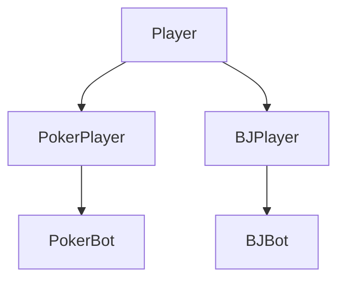

# ♠️ Aventurine's Adventures: Java Casino Project

A comprehensive Java console-based casino application featuring high-fidelity implementations of **Texas Hold'em Poker** and **Blackjack**, powered by an industry-leading **God Bot AI** ecosystem.

---

## 🕹️ Project Architecture

The system is built on a modular, inheritance-based framework that allows for seamless integration of different card games while sharing a universal "Primogem" ✨ economy.

### Core Systems
- **The Economy**: Players start with a user-defined buy-in between **500 and 1000** primogems. Chips are universal; your poker winnings can be taken immediately to the blackjack table.
- **The Casino Engine (`Casino.java`)**: Manages the high-level game loop, terminal interface, and session persistence.
- **Universal Data Layer**: Atomic card physics handled by `Card.java` and `Deck.java`.

### Player Inheritance Hierarchy

---

## 🃏 Texas Hold'em Poker Engine

The flagship poker suite simulates a "No Limit" environment with complex pot management, hand evaluation, and predatory AI behavior.

### 1. Table Dynamics & Game Flow
- **Seat Capacity**: Supports **6 to 12 players** per table.
- **The Orbit System**: Dealer rotation is tracked via the orbit system, with blinds increasing every 2-3 orbits to ensure game progression.
- **Skip Mode**: When only bots remain in a hand, human players can trigger **"Skip Mode"** to fast-forward the simulation and see the results instantly.
- **Pot Logic (`PokerPot.java`)**: Correctly handles all-ins and side-pots using a **Threshold Reconstruction** algorithm that perfectly calculates eligibility for multi-winner showdowns.
- **Official Increment Rule**: Implements the standard "Previous Increment" min-raise rule. The engine natively enforces a **Zero-Debt Architecture** that prevents negative chip stacks and intelligently converts shallow bets into legal All-Ins.

### 2. The Overlord AI Hierarchy (`PokerBot.java`)
The hierarchy is split into three intelligence tiers, each with hardcoded behavioral triggers and audited mathematical win-rates.

#### **🔴 Level 2: The God Bot (GTO Apex Predator)**
The pinnacle of the engine, designed for high-stakes dominance. (12% native spawn rate).
- **Split-Brain Logic**: Switches between "Safe Accountant" (vs. Fish) and "Predatory Hero" (1v1 vs. Pros).
- **Iron Chin Protocol**: Triggershero-calls with Any Pair (`Rank <= 8`) and ignores board-scares when `depthRatio < 0.5`.
- **Soul Reading Scanner**: Reverse-engineers linear bot behavior by detecting bets `>= 2.6x` to deduce "Nut" hands with 100% accuracy.
- **Predatory 1v1 Bluffing**: Spikes C-bet frequency to **60%** when isolated heads-up against Dumb bots.

#### **🔵 Level 1: The Smart Bot (Linear Heuristic)**
- **Linear Aggression**: Plays a fixed 32-hand range and communicates strength through predictable bet-sizing.
- **Draw Awareness**: Follows a hardcoded **50% call frequency** on flush/straight draws, making them "sticky" but exploitable.

#### **🟢 Level 0: The Dumb Bot (Calling Station)**
- **Liquidity Providers**: Folds **12%** of the time purely by RNG and shoves all-in with a **3%** wildcard frequency.
- **Logic Trap**: Faces an **85% fold rate** when hitting certain stack-depth calculation walls.

---

## 📉 The Poker Hegemony (Performance Metrics)

*Verified through 30,000-game "Full-Street" simulations (v3.1):*

| Matchup | Winner | **Win %** | Loser | **Win %** |
| :--- | :--- | :--- | :--- | :--- |
| **Dumb vs. God** | 🔴 **God Bot** | **99.93%** | 🟢 Dumb Bot | **0.07%** |
| **Dumb vs. Smart** | 🔵 **Smart Bot** | **97.42%** | 🟢 Dumb Bot | **2.58%** |
| **Smart vs. God** | 🔴 **God Bot** | **91.63%** | 🔵 Smart Bot | **8.37%** |

---

## 🂡 Blackjack Logic (`Blackjack.java`)

A faithful recreation of casino blackjack with professional house rules.
- **Minimum Bet**: 50 primogems.
- **Dealer Rules**: House dealer (`BJBot`) must stay on 17.
- **Dynamic Payouts**: Standard wins pay **1:1**; Naturals pay **3:2**.
- **The Ace Engine**: Dynamically re-evaluates Ace values (1 vs 11) to maximize hand strength without busting.

---

## 🌑 Nightmare Mode (Trigger: edjiang1234)
For players seeking the ultimate challenge, entering the casino as **`edjiang1234`** promotes all active bots to **Level 2 (God Tier)** and enables "Two-Faced" predatory aggression trackers.

---
*Created by edmark & Antigravity AI*
